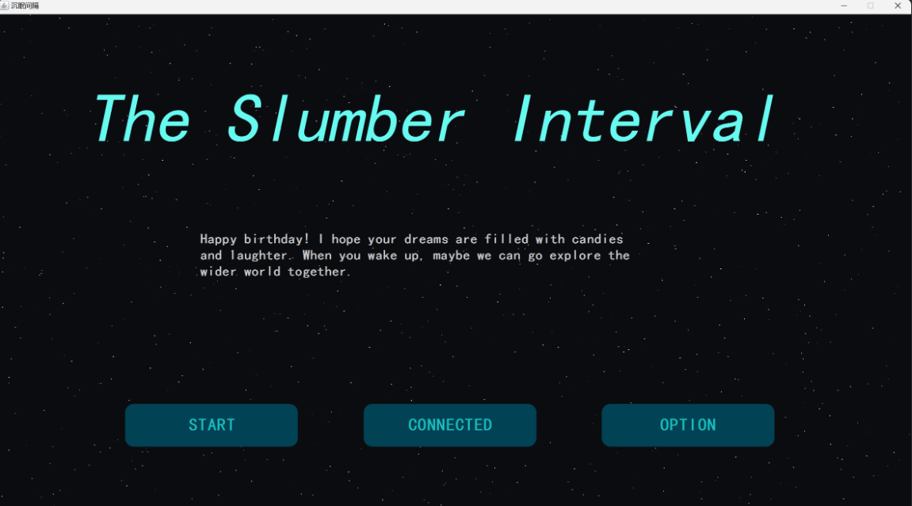

## 项目

一个用java写的视觉小说游戏框架，使用mysql数据库与其相连，下面是大致情况

（放的图片是第一版的，现在会开始做重置版，也是v2版，一些地方会有比较大的改动



故事的内容用.txt文件格式，纯文档书写，即：书写过程中，不需要会任何编程知识，只需要记住一些书写规则即可。


## 书写规则

下面我会介绍一下具体书写规则


### 第1种：对话语句

#### 组成

`对话者：对话内容`
#### 例如


`旷月：领队，如果你遇到了什么线索可以和我们说。`


### 第2种：普通语句

#### 组成

`#段落内容`
#### 例如


`#一群人很快围在了一起，蓝清了声嗓子，故作镇静。`

### 第3种：图片音频

#### 组成

`-图片`

`~~背景音乐（循环播放）`

`~音效（仅播放一次）`
#### 例如


### 第4种：结束语句

#### 组成

`end`
#### 例如

`end`

程序读取到新的一行里是end，则会退出当前章节


### 第5种：注释语句

#### 组成

`//注释内容`
#### 例如

`//读取到注释语句，程序会跳过分析`

### 总结

以上就是基础的单语句

| 名称    | 规则                                                |
| ----- | ------------------------------------------------- |
| 对话语句  | `对话者：对话内容`                                        |
| 普通语句  | `#段落内容`                                           |
| 图片与音频 | `-图片`<br>`~~背景音乐（会循环播放）`<br>`~音效（仅会播放一次）`         |
| 结束语句  | `end`                                             |
| 注释语句  | `//注释内容`                                          |
| 成就语句  | 目前还没设计好，知道有这个语句就行，执行到这个语句时会触发一个成就，暂定形式是<br><成就名称> |

掌握以上几种句式，差不多就可以写出一个不错的故事了

书写示例：

``` 
-木屋_白天
~~第1节音乐1
#我睁开了眼，发现自己正躺在床上。
#朦胧的晨光透过半拉开的窗帘，斑驳地洒在的房间内，窗外依稀可见一片草地和几座屋子。
我：（这是哪里？）
#我又看向四周，自己处在一个木质的小房间里，布置简约但温馨。
#我试图回想起昨晚发生的事，但很快发现什么也想不起来。
#……
#不仅仅是昨晚，所有的记忆就像被抹去般一干二净。
~推门声
#忽然间，门轴发出细微的嘎吱声，门板分离。
我：（有人来了！）
```

关于故事中用到的图片与音频这样存放（后面可能会有点变动，但是改动应该不会很大

```
其中<>代表一个文件夹

<故事名称>
	<StoryContent>
		<C1:章节一名称>
		<C2:章节二名称>
		<C3:章节三名称>
	<audios>
		<BackgroundMusic>
			存放背景音乐，格式为.mp3或.MP3
		<AudioEffects>
			存放音效，格式和背景音乐的一样
	<images>
		存放图片，目前仅支持.png
```

图片和音频的命名，和你故事中所引用的相同

- 其中音频的话可以在一些音乐软件里下载
- 图片的话我会教你部署一个本地的AI绘画模型，然后去生成图片（需要笔记本预留40G左右的内存，或者如果方便，也可以用我的宿舍里的台式机生成图片


接下来说明一些比较复杂的书写规则，其实也不难


### 第6种：选择语段

#### 组成

￥`A`选项1内容`B`选项2内容`C`选项3内容
`A`
选项A里面的分支内容
`B`
选项B里面的分支内容
`C`
选项C里面的分支内容
￥
回到正文

（￥这个符号在键盘4上面，中文模式打出来就是￥，英文模式打出来是$
#### 例如


```
#萤从肩上的包里拿出一个摄像机，揽住我的肩膀摆了个POS。
￥A我也摆了个POSB我扮了个鬼脸C我面无表情
A
~拍照声
#咔嚓一声，萤记录下了这一瞬间。
萤：我要好好留着这一张照片！
B
~拍照声
#咔嚓一声，萤记录下了这一瞬间。
萤：哇，好可爱呀哈哈！我一定会保存好它的！
我：倒也不必。
C
~拍照声
#咔嚓一声，萤记录下了这一瞬间。
#萤看着照片直皱眉。
萤：唉，你也不笑一个，不行，我们再来一张！
#说着她又拿起相机开始拍照。
#我对着镜头努力扬起嘴角。
~拍照声
#萤对新照片十分满意。
萤：这个不错，我会好好保留它的！
￥
#拍完照后，萤把相机塞到包里。
```

### 第5种：变量语句

#### 组成

`@@定义变量`

`@修改变量值`
#### 原理

为了实现剧情的分支，可以去定义一个变量，如：

@@角色A的好感度

在做出某些选项的时候，可以去改变变量的大小，如：

@角色A的好感度+10

目前，改变大小仅可以进行加减法

### 第6种：分支语段

这里可能有点难理解

如果觉得太复杂，我们可以一起讨论一下如何去设计分支

#### 分支语段组成

##### 1`*`分支语段

```
*
需要让分支变量满足的条件
*
```

- 如果满足则会往下执行，并记录下当前`*层`为1
- 如果不满足会接着找下一个`1*语段`


##### 2`*`分支语段

```
**
需要让分支变量满足的条件
**
```

- 如果满足则会往下执行，并记录下当前`*层`为2
- 如果不满足会接着找下一个`2*语段`


`还有3*、4*分支语段等等`

##### 空`*`语段

其中如果`**语段`间没有任何语句，如：
```
*
*
```

这样子的形式，则一定可以命中，然后执行下面的语段


如果已经命中了一个`1*分支语段`，会记录下当前`*层`为1，那么之后如果遇到`*层`小于等于1的分支语段会直接跳过，直至遇到`2*分支语段`

#### 例如

```
*
角色A的好感度>80
*
```
这里是
满足`角色A的好感度>80`时
要执行的语句
```
*
角色A的好感度>60
*
```
这里是
满足`角色A的好感度>60且<80`时
要执行的语句
```
*
*
```
这里是
以上条件都没命中时
要执行的语句
```
**
**
```
这里语句汇总的地方，会从这里开始一起进行一段故事，直到碰到`***语段`再次进行分支

#### 分支章节

上面说的分支语段是章内分支，现在讲章外分支，（章外分支是玩家可以看到的分支，在故事界面会展示出来章节分支

每个故事都由不同的章节组成，比如章节1、章节2，每个章节一个文本文档[.txt]，有一些章节可能会出现分支，假如章节三分为3个分支，即章节3.1、章节3.2、章节3.3

那么章节3.1/3.2/3.3要分别创建一个.txt文件，并且在文档开头写出命中条件

如要进入章节3.1，需要满足：
@角色A的好感=100

进入章节3.2，需要满足：
@角色A的好感=0

进入章节3.3，可以不写命中条件，没有满足上面两个就进入章节3.3

至于在文档开头，如何写出命中条件，这个我还是思考，欢迎一起讨论

## 数据库相关的内容


### **一、项目概述**

本项目旨在开发一个与mysql数据库相结合的Java视觉小说游戏框架，该框架支持创作者和玩家两种身份的用户。创作者可以创建和编辑故事，而玩家则可以体验这些故事。游戏具有全局配置功能，如音乐开关、文本速度调节和自动剧情等。故事由多个章节组成，部分章节可能包含分支，玩家的选择将决定他们进入哪个分支章节。游戏还包含存档系统，用于记录玩家的游戏进度，以及成就系统，用于鼓励玩家的游戏成就。

### **二、用户角色与权限**

1. **创作者**：
    - 权限：创建和编辑故事，添加和修改章节，设置分支章节，添加成就，查看所有成就。
    - 功能：管理自己的故事和章节，设计游戏剧情和分支，设置成就条件。
2. **玩家**：
    - 权限：体验故事，进行游戏选择，配置全局设置，存档和读取进度，查看和解锁成就。
    - 功能：玩游戏，做出选择以影响剧情走向，调整游戏设置以适应个人喜好，保存和加载游戏进度，查看已获得的成就。


### **三、游戏功能需求**

1. **全局配置**：
    - 玩家和创作者可以配置音乐开关、文本速度、自动剧情等全局设置。
2. **故事与章节**：
    - 创作者可以创建和编辑故事，每个故事包含多个章节。
    - 章节可以有分支，玩家的选择将决定进入哪个分支章节。
    - 分支最多分为3个。
3. **存档系统**：
    - 每个用户都可以存储自己的游戏进度，即存档。
    - 存档记录当前章节的读取行数、嵌入层数以及分支因素。
    - 玩家可以随时存档和读取进度。
4. **成就系统**：
    - 创作者可以添加成就，并设置成就条件。
    - 玩家在满足条件时解锁成就，并可以查看已获得的成就。


### **四、数据库设计需求**

（这个是我当前设计的，后面一定会改，所以如果你负责这块，现在不着急写，知道就行

用户表（UID，用户名，密码，角色[创作者或玩家]，注册时间，最后登入时间，音乐状态，文本呈现速度，是否启用自动剧情）

故事表（故事ID，故事名称，故事简介，创作者）

章节表（章节ID，故事ID，章节名称，章节简介，是否是分支）

存档（存档ID，UID，故事ID，章节ID，进度行，嵌入层，是否是分支）

成就表（成就ID，故事ID，成就名称，成就内容）

用户成就表（成就UID，UID，成就ID，是否获得该成就，成就获得时间）

分支因素（因素ID，因素大小）


## 总结

上面是这次数据库主要要完成课设的内容